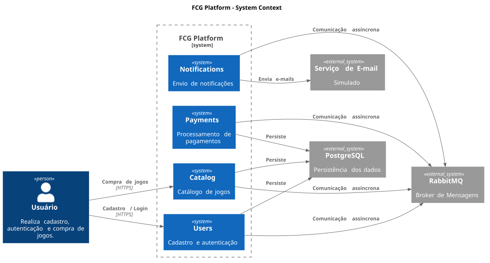
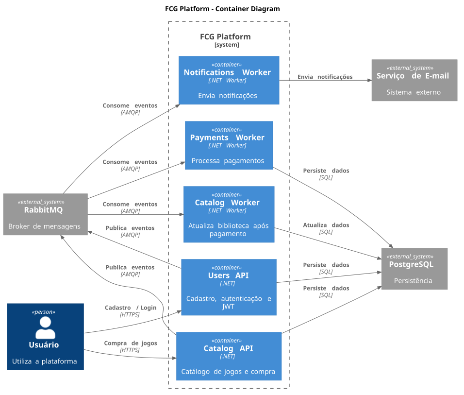

# 🏛️ Arquitetura da FCG Platform

Este documento apresenta uma visão geral da arquitetura da **FCG Platform**, uma plataforma baseada em microsserviços.

A solução foi evoluída de uma arquitetura monolítica para uma arquitetura distribuída, composta por microsserviços independentes responsáveis pelos domínios de usuários, catálogo, pagamentos e notificações.

## 📑 Sumário

- [🧩 Visão Geral da Arquitetura](#-visão-geral-da-arquitetura)
- [📐 Diagramas Arquiteturais](#-diagramas-arquiteturais)
- [📨 Arquitetura Orientada a Eventos](#-arquitetura-orientada-a-eventos)

# 🧩 Visão Geral da Arquitetura

A **FCG Platform** é composta por quatro domínios de negócio implementados como microsserviços independentes.

Cada microsserviço possui seu próprio repositório, ciclo de vida e responsabilidades, podendo ser evoluído e implantado de forma independente.

| Microsserviço     | Componentes                  | Responsabilidade                                                                      |
| ----------------- | ---------------------------- | ------------------------------------------------------------------------------------- |
| **Users**         | Users API                    | Cadastro, autenticação e autorização de usuários.                                     |
| **Catalog**       | Catalog API e Catalog Worker | Gerenciamento do catálogo de jogos, compras e atualização da biblioteca dos usuários. |
| **Payments**      | Payments Worker              | Processamento e simulação de pagamentos.                                              |
| **Notifications** | Notifications Worker         | Processamento de eventos e envio de notificações.                                     |

Os componentes são executados como containers independentes e utilizam comunicação síncrona via HTTP para entrada de requisições externas e comunicação assíncrona via mensageria para integração entre os domínios.

A comunicação orientada a eventos utiliza o **RabbitMQ** como broker de mensagens, permitindo que os serviços sejam desacoplados e processem eventos de forma independente.

# 📐 Diagramas Arquiteturais

Os diagramas abaixo apresentam diferentes níveis de visão da arquitetura utilizando o modelo **C4 Model**.

## Diagrama de Contexto

Apresenta uma visão geral da plataforma, seus usuários e integrações externas.

## Diagrama de Containers

Apresenta os principais containers da solução, incluindo APIs, Workers, infraestrutura de mensageria e persistência.

# 📨 Arquitetura Orientada a Eventos

A **FCG Platform** utiliza uma arquitetura orientada a eventos para comunicação assíncrona entre os microsserviços.

A utilização de mensageria permite reduzir o acoplamento entre os domínios, possibilitando que cada serviço evolua e processe informações de forma independente.

O **RabbitMQ** é utilizado como broker de mensagens, responsável pelo transporte dos eventos entre os serviços.

Para detalhes sobre eventos, produtores, consumidores e fluxos de comunicação:

👉 [Arquitetura Orientada a Eventos](event-driven-architecture.md)
